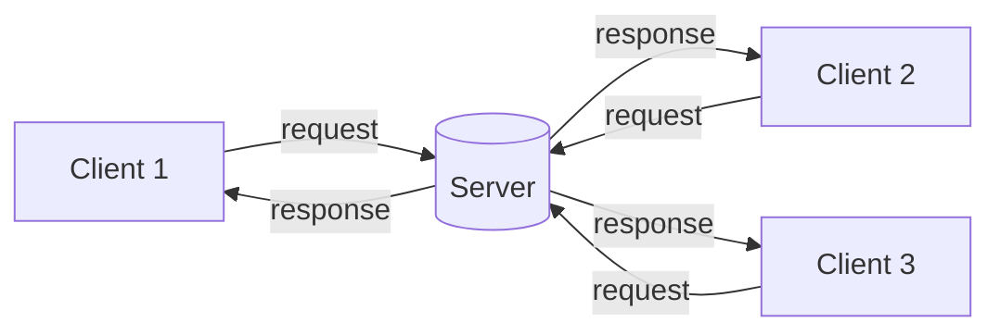
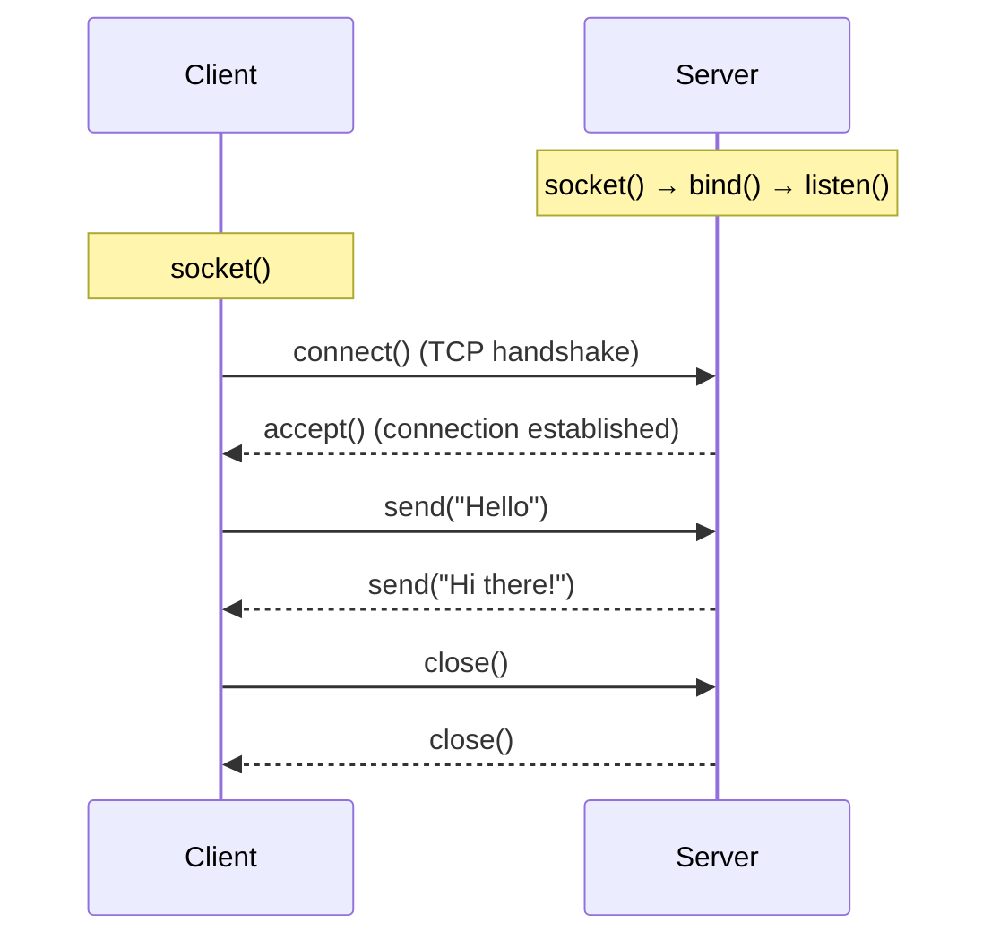

# Sockets: A Beginner-Friendly Guide

> **Phase 1 – Topic Study: Sockets**
> A simple but complete walkthrough of what sockets are, how they work, and the basic syntax used to work with them.

---

## Table of Contents

1. [What is a Socket?](#1-what-is-a-socket)
2. [Why Do We Need Sockets?](#2-why-do-we-need-sockets)
3. [Key Concepts You Must Know First](#3-key-concepts-you-must-know-first)
4. [The Client–Server Model](#4-the-clientserver-model)
5. [Types of Sockets](#5-types-of-sockets)
6. [TCP vs UDP](#6-tcp-vs-udp)
7. [How a Socket Connection Works (Step by Step)](#7-how-a-socket-connection-works-step-by-step)
8. [Syntax Reference (Python)](#8-syntax-reference-python)
9. [Handling Multiple Clients](#9-handling-multiple-clients)
10. [Blocking vs Non-Blocking Sockets](#10-blocking-vs-non-blocking-sockets)
11. [Real-World Uses of Sockets](#11-real-world-uses-of-sockets)
12. [Common Problems and Tips](#12-common-problems-and-tips)
13. [Quick Summary](#13-quick-summary)
14. [References](#14-references)

---

## 1. What is a Socket?

A **socket** is one endpoint of a two-way communication link between two programs running on a network.

In simple words: **a socket is a doorway that a program uses to send and receive data over a network.**

**Real-life analogy: a phone call 📞**

| Phone call                       | Socket communication                  |
| -------------------------------- | ------------------------------------- |
| Your phone                       | Socket                                |
| Phone number                     | IP address + port number              |
| Dialing a number                 | Connecting to a server                |
| Picking up the phone             | Accepting a connection                |
| Talking and listening            | Sending and receiving data            |
| Hanging up                       | Closing the socket                    |

Just like you need a phone to make or receive a call, a program needs a socket to talk to another program.

---

## 2. Why Do We Need Sockets?

Programs on different computers (or even on the same computer) often need to exchange data. For example:

- Your browser asks a web server for a page.
- A chat app sends your message to your friend.
- A multiplayer game sends player positions to all players.

The operating system and the network handle the hard parts (routing, delivery, etc.). **Sockets give programmers a simple interface** to use all of that, so we can just say "send this data" and "receive that data" without worrying about the hardware underneath.

---

## 3. Key Concepts You Must Know First

### IP Address
A unique address that identifies a device on a network (like a house address).
- Example (IPv4): `192.168.1.10`
- `127.0.0.1` (also called `localhost`) always means "this same computer". It is very useful for testing.

### Port Number
A number from **0 to 65535** that identifies a specific program or service on a device (like a room number inside the house).
- HTTP → port `80`
- HTTPS → port `443`
- SSH → port `22`
- Ports `0–1023` are reserved for well-known services. For your own programs, use ports above `1024` (e.g. `5000`, `8080`).

### Protocol
A set of rules for how data is sent. The two most important ones for sockets are **TCP** and **UDP** (explained in section 6).

### Socket Address
The combination that uniquely identifies a socket endpoint:

```
Socket Address = IP Address + Port Number
Example:         192.168.1.10 : 5000
```

A full connection is identified by **two** socket addresses: one for the client and one for the server.

---

## 4. The Client–Server Model

Most socket programs follow the **client–server model**:

- **Server**: waits for incoming connections and provides a service. It has a known address (IP + port).
- **Client**: starts the communication by connecting to the server.



> There is also the **peer-to-peer (P2P)** model, where every program acts as both client and server. It still uses sockets underneath.

---

## 5. Types of Sockets

| Socket Type          | Protocol | Description                                               | Python constant     |
| -------------------- | -------- | --------------------------------------------------------- | ------------------- |
| **Stream socket**    | TCP      | Reliable, ordered, connection-based communication         | `SOCK_STREAM`       |
| **Datagram socket**  | UDP      | Fast, connectionless, no delivery guarantee               | `SOCK_DGRAM`        |
| **Raw socket**       | IP       | Direct access to lower-level protocols (advanced use)     | `SOCK_RAW`          |

Sockets also have an **address family**:

- `AF_INET` → IPv4 addresses
- `AF_INET6` → IPv6 addresses
- `AF_UNIX` → communication between processes on the same machine (uses file paths instead of IP addresses)

In this document we focus on **stream (TCP)** and **datagram (UDP)** sockets, since those are the most common.

---

## 6. TCP vs UDP

**TCP (Transmission Control Protocol)** is like a **phone call**: you connect first, then talk, and both sides know if the line drops.

**UDP (User Datagram Protocol)** is like **sending postcards**: you just drop them in the mailbox. Some may get lost or arrive out of order, but it's quick and simple.

| Feature              | TCP                                   | UDP                                    |
| -------------------- | ------------------------------------- | -------------------------------------- |
| Connection           | Connection-oriented (handshake first) | Connectionless                         |
| Reliability          | Guaranteed delivery, retransmits lost data | No guarantee                      |
| Order of data        | Data arrives in order                 | May arrive out of order                |
| Speed                | Slower (extra checks)                 | Faster (less overhead)                 |
| Data form            | Continuous stream of bytes            | Separate packets (datagrams)           |
| Use cases            | Web, email, file transfer, SSH        | Video calls, online games, DNS, live streaming |

**Rule of thumb:** use **TCP** when correctness matters, use **UDP** when speed matters more than perfection.

---

## 7. How a Socket Connection Works (Step by Step)

### TCP Server Steps

| Step | Function     | What it does                                                        |
| ---- | ------------ | ------------------------------------------------------------------- |
| 1    | `socket()`   | Create a socket                                                     |
| 2    | `bind()`     | Attach the socket to an IP address and port                         |
| 3    | `listen()`   | Start waiting for incoming connections                              |
| 4    | `accept()`   | Accept a client connection (returns a **new** socket for that client) |
| 5    | `recv()` / `send()` | Receive and send data                                        |
| 6    | `close()`    | Close the connection                                                |

### TCP Client Steps

| Step | Function     | What it does                                  |
| ---- | ------------ | --------------------------------------------- |
| 1    | `socket()`   | Create a socket                               |
| 2    | `connect()`  | Connect to the server's IP and port           |
| 3    | `send()` / `recv()` | Send and receive data                  |
| 4    | `close()`    | Close the connection                          |

### Flow Diagram



> **Important:** the server has **two kinds of sockets**: the *listening socket* (waits for new clients) and a *connection socket* for each client it accepts.

### UDP is simpler

UDP has **no** `listen()`, `accept()`, or `connect()` steps. The server just does `socket()` → `bind()` → `recvfrom()` / `sendto()`, and the client does `socket()` → `sendto()` / `recvfrom()`.

---

## 8. Syntax Reference (Python)

Python's built-in `socket` module is used for all of this. No installation is required.

```python
import socket
```

### 8.1 Creating a socket

```python
s = socket.socket(socket.AF_INET, socket.SOCK_STREAM)   # TCP
s = socket.socket(socket.AF_INET, socket.SOCK_DGRAM)    # UDP
```

### 8.2 TCP server syntax

```python
s.bind(("127.0.0.1", 5000))     # attach to IP and port
s.listen(5)                     # wait for connections (5 = max queue size)
conn, addr = s.accept()         # returns a new socket + client's address
data = conn.recv(1024)          # receive up to 1024 bytes
conn.sendall(b"reply")          # send data back
conn.close()                    # close the client connection
```

### 8.3 TCP client syntax

```python
s.connect(("127.0.0.1", 5000))  # connect to the server
s.sendall(b"hello")             # send data
data = s.recv(1024)             # receive data
s.close()                       # close the socket
```

### 8.4 UDP syntax

```python
s.bind(("127.0.0.1", 6000))                    # server: attach to IP and port
data, addr = s.recvfrom(1024)                  # receive data + sender's address
s.sendto(b"hello", ("127.0.0.1", 6000))        # send data to a given address
```

### 8.5 Useful notes

- Sockets send **bytes**, not strings. Convert with `.encode()` and `.decode()`:

```python
b = "hello".encode()     # string → bytes
text = b.decode()        # bytes → string
```

- `recv(1024)` means "read **up to** 1024 bytes". It may return less. An **empty result** (`b""`) means the other side closed the connection.
- `sendall()` keeps sending until all data is sent, so it is safer than `send()`.
- Use `with` to close a socket automatically:

```python
with socket.socket(socket.AF_INET, socket.SOCK_STREAM) as s:
    s.connect(("127.0.0.1", 5000))
```

> **Try it yourself:** put the server steps in one file and the client steps in another, run the server first, and then run the client in a second terminal. Test on `127.0.0.1` before using a real network.

---

## 9. Handling Multiple Clients

A basic server handles **one client at a time**. Real servers must handle many clients at once. Common approaches:

| Approach                | How it works                                                      | Good for                     |
| ----------------------- | ----------------------------------------------------------------- | ---------------------------- |
| **Multithreading**      | Create a new thread for each client                               | Beginners, small/medium apps |
| **Multiprocessing**     | Create a new process for each client                              | CPU-heavy tasks              |
| **I/O multiplexing** (`select`, `selectors`) | One thread watches many sockets and reacts to whichever is ready | Many connections, efficient |
| **Async I/O** (`asyncio`) | Non-blocking, event-driven code with `async`/`await`            | Modern, high-scale servers   |

### Threading idea in one line

The server loops on `accept()`, and each time a client connects, it hands that client to a new thread:

```python
threading.Thread(target=handle_client, args=(conn, addr)).start()
```

Here `handle_client` is your own function that does the `recv()` / `sendall()` work for that one client. While it runs in the background, the main loop goes back to `accept()` for the next client.

---

## 10. Blocking vs Non-Blocking Sockets

By default, sockets are **blocking**: functions like `accept()` and `recv()` **pause your program** until something happens (a client connects or data arrives).

- **Blocking mode** (default): simple to write, but the program waits.
- **Non-blocking mode**: functions return immediately, even if nothing is ready. You must check readiness yourself, usually with `select` or `asyncio`.
- **Timeouts**: a middle path, where the socket waits for a limited time and then raises an error.

```python
s.setblocking(False)    # non-blocking mode
s.settimeout(5)         # wait at most 5 seconds
```

---

## 11. Real-World Uses of Sockets

- 🌐 **Web browsing**: browsers open TCP sockets to web servers (HTTP/HTTPS).
- 💬 **Chat apps**: WhatsApp, Discord, and Slack rely on socket-based connections (often WebSockets).
- 🎮 **Online games**: fast UDP or TCP communication between players and servers.
- 📧 **Email**: SMTP, IMAP, and POP3 all run over sockets.
- 📁 **File transfer**: FTP, SFTP, and SSH.
- 📹 **Video calls and streaming**: usually UDP-based for low delay.
- 🗄️ **Databases**: clients connect to MySQL, PostgreSQL, and others through sockets.

> **WebSockets**: a related technology that gives web browsers a persistent two-way connection with a server (built on top of TCP). It's what makes live chats and real-time dashboards possible.

---

## 12. Common Problems and Tips

| Problem | Cause | Fix |
| ------- | ----- | --- |
| `Address already in use` | Port still held by a previous run | Set `SO_REUSEADDR` before `bind()` (see below) |
| `Connection refused` | Server isn't running or wrong port | Start the server first; check IP and port |
| Program hangs at `recv()` or `accept()` | Blocking call waiting for data | Use timeouts, threads, or non-blocking mode |
| Messages get merged or split | TCP is a **stream**, so it has no message boundaries | Define your own message format (e.g. add a length prefix or end with a newline) |
| Can't connect from another computer | Bound to `127.0.0.1` (local only) | Bind to `0.0.0.0` and check firewall settings |
| Garbled text | Forgot to encode/decode | Always `.encode()` before sending and `.decode()` after receiving |

Syntax for the reuse-address fix:

```python
s.setsockopt(socket.SOL_SOCKET, socket.SO_REUSEADDR, 1)
```

**Good habits**

- Always close sockets (use `with` or `try/finally`).
- Never trust incoming data. Validate it.
- Handle exceptions like `ConnectionResetError` and `socket.timeout`.
- Test locally on `127.0.0.1` first.

---

## 13. Quick Summary

- A **socket** is an endpoint for sending and receiving data over a network.
- A socket address = **IP address + port number**.
- Most programs use the **client–server model**.
- **TCP (`SOCK_STREAM`)** is reliable and ordered. **UDP (`SOCK_DGRAM`)** is fast but unreliable.
- **Server flow:** `socket → bind → listen → accept → recv/send → close`
- **Client flow:** `socket → connect → send/recv → close`
- To serve many clients, use **threads, `select`, or `asyncio`**.
- Sockets transfer **bytes**, so remember to encode and decode.

---

## 14. References

- Python `socket` module docs: https://docs.python.org/3/library/socket.html
- Python Socket Programming HOWTO: https://docs.python.org/3/howto/sockets.html
- Beej's Guide to Network Programming (C, but great for concepts): https://beej.us/guide/bgnet/
- Real Python: Socket Programming in Python: https://realpython.com/python-sockets/
